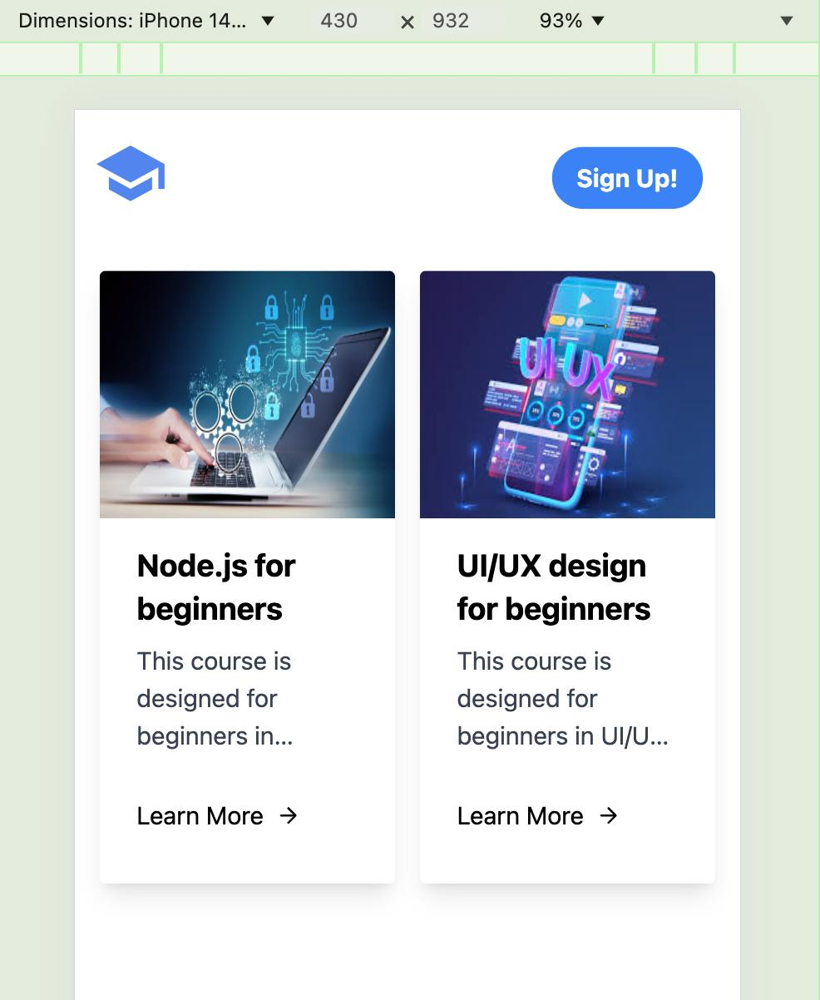

# Courses App Example

## Check it out!
https://nest-angular-playground-frontend.onrender.com/

## Developer notes
1. Start backend by running `npm run start:dev` in the backend directory.
2. Start frontend by running `npm start` in the frontend directory.
3. Open http://localhost:4200/ in your browser.

